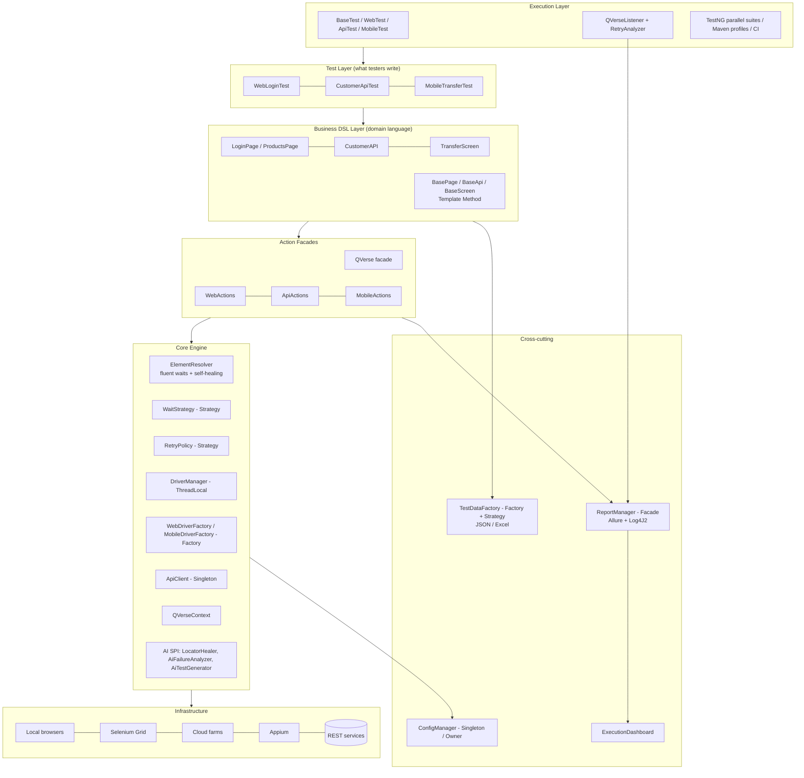

# QVerse — Architecture Guide

> QVerse is an automation **ecosystem**, not a script library. Testers describe *business intent*;
> the platform owns synchronisation, resilience, sessions, data, evidence and analytics.

## 1. Architecture diagram



## 2. Layers

| Layer | Responsibility | Who touches it |
|---|---|---|
| **Test** | Business scenarios, assertions in business words | Testers |
| **Business DSL** (`business`, examples `pages/screens/api`) | Page/Screen/Service objects exposing domain actions (`clickLogin`, `createCustomer`, `transferMoney`) | Testers + automation engineers |
| **Action facades** (`web`, `api`, `mobile`, `QVerse`) | Generic reusable actions: click, type, tap, swipe, get, post, verify… | Framework team |
| **Core** (`core.*`) | Waits, retries, locators, self-healing, sessions, context, exceptions, AI SPI | Framework team |
| **Configuration** (`config`) | Typed layered config (system → env vars → env file → defaults) | DevOps / everyone |
| **Data** (`data`) | JSON/Excel readers, object mapping, pluggable sources | Testers |
| **Reporting** (`reporting`) | Allure steps, screenshots, logs, API traffic, dashboard | Framework team |
| **Utilities** (`utils`) | Random data, JSON helpers | Everyone |
| **Execution** (`testng`) | Base tests, listener, retry analyzer, data providers | Framework team |

**Dependency rule:** arrows only point downward. Core never imports business or test code, so the core is
reusable for Banking, Telecom, Healthcare, ERP… unchanged.

## 3. Folder structure

```
QVerse/
├── pom.xml                         # build, dependencies, profiles
├── Jenkinsfile                     # Jenkins pipeline
├── docker-compose.grid.yml         # local Selenium Grid
├── .github/workflows/qverse-ci.yml # GitHub Actions
├── docs/                           # this documentation set
└── src/
    ├── main/java/com/mounir/learn/qverse/   # ---- FRAMEWORK (reusable product) ----
    │   ├── QVerse.java             # single entry-point facade
    │   ├── config/                 # QVerseConfig, ConfigManager, enums
    │   ├── core/
    │   │   ├── ai/                 # LocatorHealer, AiFailureAnalyzer, AiTestGenerator, AiExtensions
    │   │   ├── context/            # QVerseContext (thread-scoped)
    │   │   ├── driver/             # DriverManager, WebDriverFactory, MobileDriverFactory
    │   │   ├── element/            # ElementResolver
    │   │   ├── exception/          # QVerseException hierarchy
    │   │   ├── locator/            # Locator (business-named, dynamic, fallbacks)
    │   │   ├── logging/            # QVerseLogger (per-thread buffer)
    │   │   ├── retry/              # RetryPolicy, ExponentialBackoffRetry
    │   │   └── wait/               # WaitStrategy, Waits
    │   ├── web/                    # WebActions
    │   ├── api/                    # ApiActions, ApiClient, ApiRequest, ApiLoggingFilter
    │   ├── mobile/                 # MobileActions, Direction
    │   ├── business/               # BasePage, BaseApi, BaseScreen
    │   ├── data/                   # TestDataFactory, JsonDataReader, ExcelDataReader
    │   ├── reporting/              # ReportManager, ExecutionDashboard, AllureEnvironmentWriter
    │   ├── testng/                 # BaseTest, WebTest, ApiTest, MobileTest, listener, retry, data providers
    │   └── utils/                  # RandomData, JsonUtils
    ├── main/resources/             # config/qverse.properties, log4j2.xml, allure/categories.json
    ├── test/java/.../examples/     # ---- PROJECT (your application) ----
    │   ├── web/   (pages/, WebLoginTest)
    │   ├── api/   (model/, CustomerAPI, CustomerApiTest)
    │   └── mobile/(model/, screens/, MobileTransferTest)
    └── test/resources/             # env/*.properties, suites/*.xml, testdata/, schemas/
```

## 4. Design patterns and why

| Pattern | Where | Decision rationale |
|---|---|---|
| **Factory** | `WebDriverFactory`, `MobileDriverFactory`, `TestDataFactory` | Creation logic (local/grid/cloud, Android/iOS, JSON/Excel) is isolated; adding a provider is a single-class change (OCP). |
| **Singleton** | `ConfigManager`, `ApiClient` | One immutable config per JVM; stateless HTTP client safely shared across threads. |
| **Strategy** | `WaitStrategy`/`Waits`, `RetryPolicy`, `TestDataReader`, `LocatorHealer` | Behaviour is swappable without touching callers (e.g. cloud-tuned retry, AI healer). |
| **Builder** | `ApiRequest` (Lombok `@Builder`/`@Singular`), `Customer` | Readable, immutable request construction with optional parts. |
| **Facade** | `QVerse`, `WebActions`, `ApiActions`, `MobileActions`, `ReportManager` | Hides Selenium/Appium/RestAssured/Allure complexity behind business verbs. |
| **Template Method** | `BaseTest`, `BasePage.load()`, `BaseScreen`, `BaseApi.request()` | Lifecycle is fixed & safe; subclasses fill in only what differs. |
| **ThreadLocal registry** | `DriverManager`, `QVerseContext`, `QVerseLogger` | Parallel execution without shared mutable state. |
| **Plug-in (ServiceLoader)** | `AiExtensions` | AI features can be dropped in as JARs without framework changes. |

## 5. Key runtime flows

**Web action** `web.click(LOGIN)`:
`ReportManager.step` → `RetryPolicy` (stale/intercepted recovery) → `ElementResolver` (FluentWait with CLICKABLE
strategy) → on timeout `LocatorHealer`s → click → Allure step + log.

**Failure**: `QVerseListener.onTestFailure` → screenshot → per-test log → `AiFailureAnalyzer` insight
(LOCATOR / SYNCHRONIZATION / ASSERTION / API_CONTRACT / ENVIRONMENT / TEST_DATA) → dashboard record → `RetryAnalyzer`.

## 6. AI readiness

| Capability | SPI | Default | Future plug-in |
|---|---|---|---|
| Self-healing locators | `LocatorHealer` | `FallbackLocatorHealer` | DOM-similarity / visual / LLM healer |
| Failure analysis | `AiFailureAnalyzer` | `RuleBasedFailureAnalyzer` | LLM reading log + screenshot |
| Test generation | `AiTestGenerator` | `TemplateTestGenerator` | LLM converting manual cases/user stories to DSL |

Register an implementation in `META-INF/services/<interface FQN>`; `AiExtensions` discovers it at runtime.

## 7. Cloud readiness
* `execution.mode=GRID|CLOUD` + `grid.url` → `RemoteWebDriver` (BrowserStack/Sauce/LambdaTest URLs with credentials from env vars).
* `LocalFileDetector` enables uploads on remote nodes.
* No machine-specific paths; everything classpath-relative; secrets from `system:env`.
